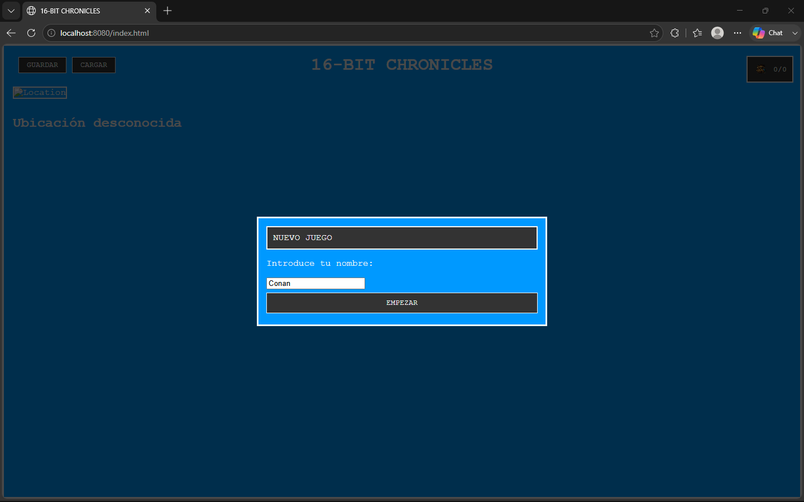
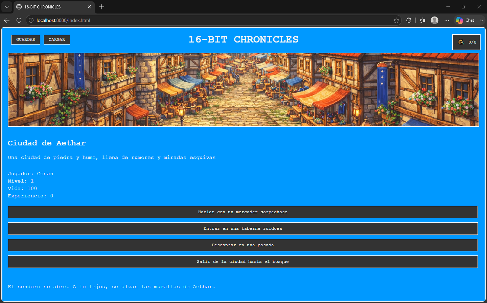

# 🎮 16-Bit Chronicles

**16-Bit Chronicles** is a retro-inspired narrative adventure game developed as a full-stack application using **Java and Spring Boot**.

The project focuses on backend-driven game state management, REST communication, persistence with JPA/Hibernate, and the integration of a lightweight frontend built with vanilla HTML, CSS and JavaScript.

## ✨ Features

* Interactive narrative adventure with player decisions
* Dynamic game state management
* Inventory system
* Random events
* Save and load game functionality
* REST API communication between frontend and backend
* Persistent saved games
* Retro 16-bit inspired user interface


## 📸 Screenshots

### Main screen



### Gameplay




## 🛠️ Technologies

### Backend

* Java 21
* Spring Boot
* Spring Data JPA
* Hibernate
* Maven
* REST API

### Frontend

* HTML5
* CSS3
* JavaScript
* Fetch API

### Database

* H2 Database

## 🏗️ Architecture

The application follows a layered architecture with separation of responsibilities:

```text
Frontend
   │
   ▼
REST API
   │
   ▼
Controller
   │
   ▼
Service
   │
   ▼
Repository
   │
   ▼
JPA / Hibernate
   │
   ▼
H2 Database
```

The project is structured around controllers for HTTP communication, services for application and game logic, repositories for data access, DTOs for transferring information between layers, and JPA entities for persistence.

## 🔌 REST API

The frontend communicates with the Spring Boot backend through REST endpoints responsible for operations such as:

* Starting a new game
* Processing player decisions
* Using inventory items
* Resetting the game
* Saving a game
* Loading a saved game

The frontend consumes these services asynchronously using the JavaScript Fetch API.

## 💾 Persistence

Saved games are persisted using **Spring Data JPA and Hibernate**, with an H2 database providing the application's data storage layer.

This allows the application to restore previously saved game states.

## 🚀 Running the project

### Requirements

* Java 21

Clone the repository:

```bash
git clone https://github.com/JosepRC80/16-bit-chronicles.git
cd 16-bit-chronicles
```

Run the tests:

```bash
./mvnw test
```

On Windows:

```powershell
.\mvnw.cmd test
```

Start the application:

```bash
./mvnw spring-boot:run
```

On Windows:

```powershell
.\mvnw.cmd spring-boot:run
```

Then open:

```text
http://localhost:8080/index.html
```

## 🎯 What I worked on

This project allowed me to practise and consolidate:

* Object-oriented programming with Java
* Development with Spring Boot
* Layered application architecture
* REST API design and consumption
* Separation of responsibilities
* DTO usage
* Persistence with JPA/Hibernate
* Repository pattern with Spring Data
* Frontend/backend communication
* Maven dependency management
* Integration of JavaScript with a Java backend

## 👤 Author

**Josep Riego Cladera**

Developed as part of my learning and portfolio in web application development.
